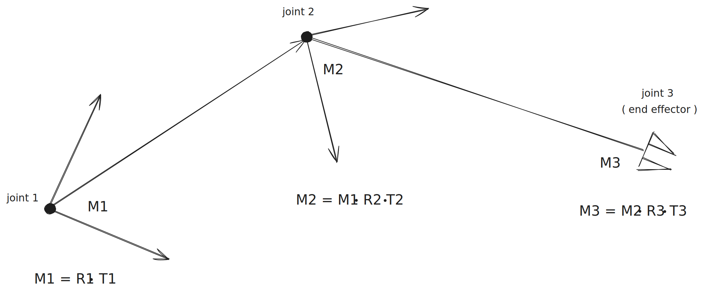

---
# You can also start simply with 'default'
theme: seriph
# random image from a curated Unsplash collection by Anthony
# like them? see https://unsplash.com/collections/94734566/slidev
background: https://images.unsplash.com/photo-1573865526739-10659fec78a5
# some information about your slides (markdown enabled)
title: |
    Miaou numérique: matrices, robotique et animation 2D
# apply unocss classes to the current slide
class: text-center
# https://sli.dev/features/drawing
drawings:
  persist: false
# slide transition: https://sli.dev/guide/animations.html#slide-transitions
transition: slide-left
# enable MDC Syntax: https://sli.dev/features/mdc
mdc: true
---

# Miaou numérique

matrices, robotique et animation 2D

<div @click="$slidev.nav.next" class="mt-12 py-1" hover:bg="white op-10">
  Press Space for next page <carbon:arrow-right />
</div>

<div class="abs-br m-6 text-xl">
  <button @click="$slidev.nav.openInEditor" title="Open in Editor" class="slidev-icon-btn">
    <carbon:edit />
  </button>
  <a href="https://github.com/slidevjs/slidev" target="_blank" class="slidev-icon-btn">
    <carbon:logo-github />
  </a>
</div>

<!--
The last comment block of each slide will be treated as slide notes. It will be visible and editable in Presenter Mode along with the slide. [Read more in the docs](https://sli.dev/guide/syntax.html#notes)
-->

---
transition: fade-out
---


# Le Présentateur

<div class="mt-10 mb-10">

  Antoine Morin-Paulhus

  Team Lead / Développeur chez <a href="http://lumen5.com" target="_blank">Lumen5</a>

  GitHub: @antoineMoPa

  Trouvez moi aussi sur LinkedIn 😃
</div>

<div class="clear-both"></div>

## Qu'est-ce que Lumen5?
Lumen5 est une plateforme de création de vidéos
pour les communicateurs B2B basée à Vancouver.


---
transition: fade-out
---


# Le contenu

À l'agenda:

- 📚 **Survol des matrices en 5 minutes** - Produit, Identité, Transformation.
- 🤖 **Représentation des joints d'un robot** - Application des matrices
- 🦾 **Cinématique inverse** - Pseudo inverse.
- 🎥 **Applications en jeux vidéo et cinéma** - Très pratique, la cinématique inverse.
- 🤹 **Démo**
<br>

<!--
Here is another comment.
-->

---
transition: slide-up
---

# 📚 **Intro aux matrices** 

Voici un exemple de matrice:

$M = \begin{bmatrix}
1 & 2 & 3\\
4 & 5 & 6\\
7 & 8 & 9\\
\end{bmatrix}$

Les matrices sont des objects mathématiques.

Elles sont composées de lignes et de colonnes.

En termes de développeur: une table.

---
transition: slide-up
---

# 📚 **Multiplication de matrices**

On multiplie les lignes de m1 par les colonnes de m2.

$M_1 = \begin{bmatrix}
a & b & c\\
d & e & f\\
g & h & i\\
\end{bmatrix}$


$M_2 = \begin{bmatrix}
j & k & l\\
m & n & o\\
p & q & r\\
\end{bmatrix}$

$M_3 = M_1 \cdot M_2 = \begin{bmatrix}
a \cdot j + b \cdot m + c \cdot p & ... & ...\\
... & ... & ... \\
... & ... & ... \\
\end{bmatrix}$

[matrix_multiplication.html](https://antoinemopa.github.io/tiny_javascript_2d_inverse_kinematics_project/matrix_demos/matrix_multiplication.html)

---
transition: slide-up
---


# 📚 Matrices de transformation

Les matrices de transformation permettent de déplacer des vecteurs.


[Démo matrices de transformation](https://antoinemopa.github.io/tiny_javascript_2d_inverse_kinematics_project/matrix_demos/index.html)

---
transition: slide-up
---


# 📚 **Identité**

Identité

N'importe quelle matrice multipliée par l'identité va en resortir intacte.

$I = \begin{bmatrix}
1 & 0 & 0\\
0 & 1 & 0\\
0 & 0 & 1\\
\end{bmatrix}$


$M_1 \cdot I = M_1$


---
transition: slide-up
---

# 📚 **Types de joints**

Les 2 types de joints les plus utilisés en robotique.

<div class="flex justify-center">

</div>

---
transition: slide-up
---

# 📚 **Représentation des joints d'un robot**

Chaque joint possède sa matrice de transformation.




---

# 📚 **Matrice de transformation locale**

Exemple de construction d'une matrice pour un joint pivot en 2D:

```
matriceJoint () {
    const c = Math.cos(this.angle);
    const s = Math.sin(this.angle);
    const x = this.len * c;
    const y = this.len * s;

    // Matrice de rotation sur l'axe des Z + Transformation
    return [
        [c, -s, x],
        [s, c, y],
        [0, 0, 1]
    ];
}
```

---

# 📚 **Matrice de transformation globale**

Exemple de construction d'une matrice pour un joint:

```
transformMatrix() {
    const T = this.matriceJoint();
    cont P = this.parent.transformMatrix();
    return math.multiply(P, T);
}
```

---

# 📚 **Cinématique inverse**

Comment placer les joints pour que l'effecteur terminal atteigne son objectif?
       

<div class="flex justify-center">

</div>

---

# 📚 **Cinématique inverse - Algo**

Comment placer les joints pour que l'effecteur terminal atteigne son objectif?
       
Répeter jusqu'à ce que l'erreur soit assez petite:
1. Déterminer la matrice jacobienne.
   - L'impact d'un changement d'angle de chaque joint sur la position de l'effecteur terminal.
2. Déterminer la pseudo-inverse de la jacobienne `math.pinv()`.
3. Modifier les angles en fonction de la pseudo-inverse.


---

<PoweredBySlidev mt-10 />
